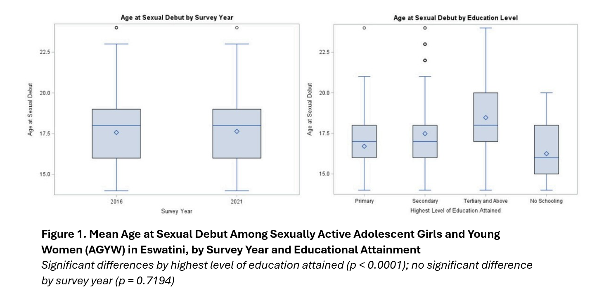
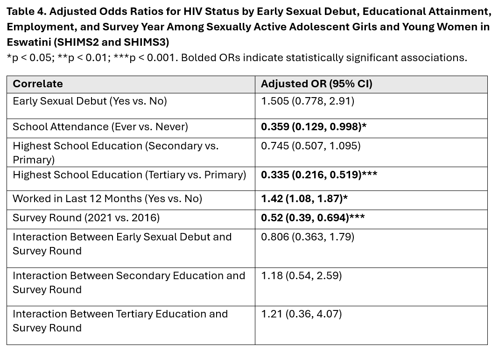

# SAS Analysis of HIV Risk Among Adolescent Girls and Young Women in Eswatini

## Overview

This repository contains SAS code and analytic outputs from a survey-weighted epidemiologic analysis examining educational attainment, early sexual debut, and HIV status among adolescent girls and young women (AGYW) aged 15–24 years in Eswatini.

Using nationally representative Population-Based HIV Impact Assessment (PHIA) survey data collected in 2016 and 2021, this project applied complex survey methods, including jackknife variance estimation and multivariable logistic regression, to identify factors associated with HIV risk.

## Key Findings

- HIV prevalence among AGYW declined from **21.0% in 2016** to **13.5% in 2021**.
- Early sexual debut declined from **13.4% in 2016** to **9.9% in 2021**.
- Educational attainment remained strongly protective against both early sexual debut and HIV infection.
- After adjustment for demographic and socioeconomic factors, early sexual debut was not independently associated with HIV status.

## Featured Analysis





## Data

This project used restricted SHIMS/PHIA data. Raw data are not included in this repository due to data use agreements.

## Skills Demonstrated

### SAS Programming

- Data management and cleaning
- Dataset merging and harmonization
- Variable recoding and derivation
- Macro programming
- Survey analysis procedures

### Epidemiologic Methods

- Cross-sectional study design
- Complex survey analysis
- Survey weighting and jackknife variance estimation
- Logistic regression modeling
- Interaction assessment and effect modification

### Public Health Analytics

- HIV surveillance data analysis
- Interpretation of epidemiologic findings
- Translation of statistical results into public health recommendations
- Communication of technical findings to technical and non-technical audiences

## Repository Structure

```text
code/
├── 01_data_management_and_harmonization.sas
├── 02_survey_weighted_analysis.sas
└── 03_logistic_regression_models.sas

docs/
└── project_summary.md

outputs/
├── figure1_age_at_sexual_debut_by_education.png
├── table1a_sample_characteristics.png
├── table1b_sample_characteristics.png
├── table3_adjusted_early_sexual_debut_model.png
└── table4_adjusted_hiv_model.png
```

## Additional Documentation

For additional details on the study background, methods, findings, and public health implications, see:

[`docs/project_summary.md`](docs/project_summary.md)

## Author

**Claire Heuberger, MPH**

Executive Master of Public Health (Applied Epidemiology)  
Rollins School of Public Health, Emory University
